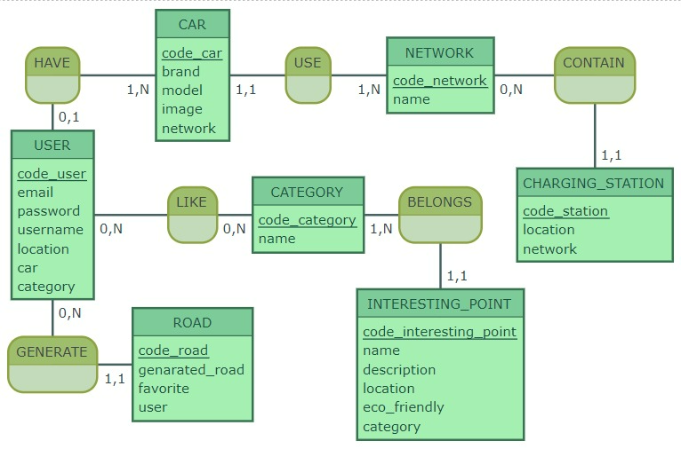

## MCD





## MLD


```CAR ( code_car, brand, model, image, network, #code_network )
NETWORK ( code_network, name )
USER ( code_user, email, password, username, location, car, category, #code_car )
LIKE ( #code_user, #code_category )
CATEGORY ( code_category, name )
CHARGING_STATION ( code_station, location, network, #code_network )
ROAD ( code_road, genarated_road, favorite, #code_user )
INTERESTING_POINT ( code_interesting_point, name, description, location, eco_friendly, #code_category )
```


## MPD